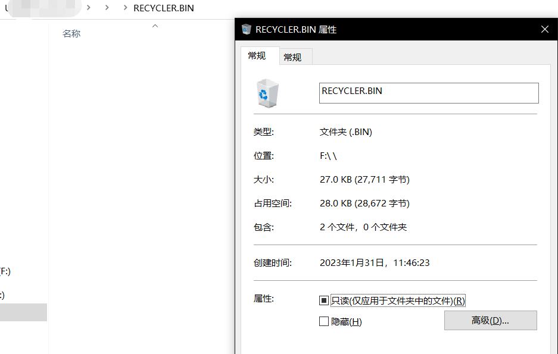
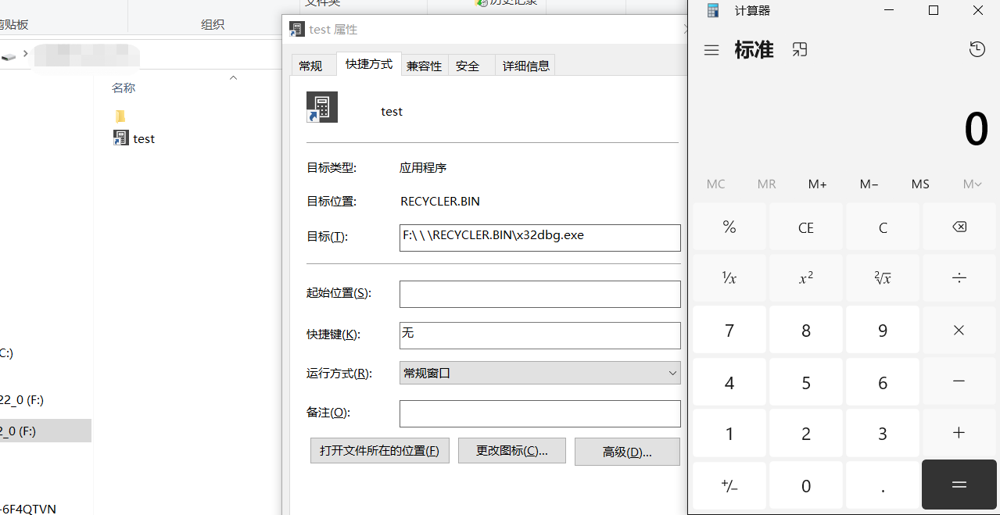

# usb-hidden

从PlugX-usb看到的技术，实现一下

1. 它创建以下目录结构：
    `*<usb volume>* :\u00A0\u00A0\RECYCLER.BIN\files`。示例：*F:\ \ \RECYCLER.BIN\files*。
2. 它在每个文件夹中创建一个名为 desktop.ini 的隐藏文件，该文件指定文件夹的图标。该文件包含以下数据：

```
[.ShellClassInfo]
IconResource=%systemroot%\system32\SHELL32.dll,7
```

3. 创建一个名为RECYLER.BIN的子文件夹。该目录充当回收站。在该目录中有一个名为files的子目录和一个隐藏的desktop.ini文件。此desktop.ini文件包含以下数据：

```
[.ShellClassInfo]
CLSID={645FF040-5081-101B-9F08-00AA002F954E}
```
  
4. 文件子文件夹包含 一些恶意软件程序



通过快捷方式打开恶意软件


